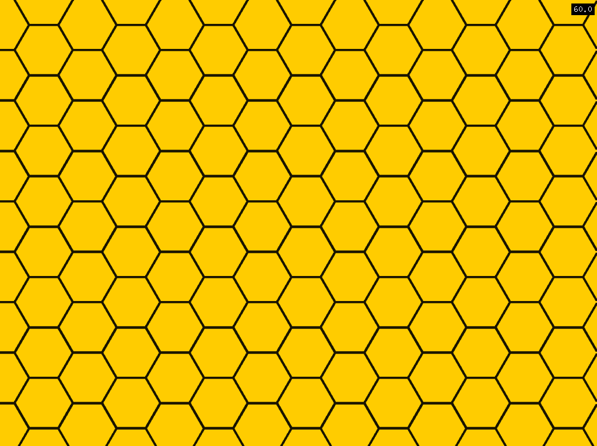

# 2D_Algorightmic_Shapes
 Various geometric shape algorithms & classes

**01_hexagonShape :** Drawing hexagon using ofTessalator and ofMesh

**02_gradientRectShape :** Drawing gradient filled rectangles

**Dependencies**
- [ofxFilikaUtils.h]([https://link](https://github.com/FilikaDesign/ofxFilika/blob/master/src/ofxFilikaUtils.h))